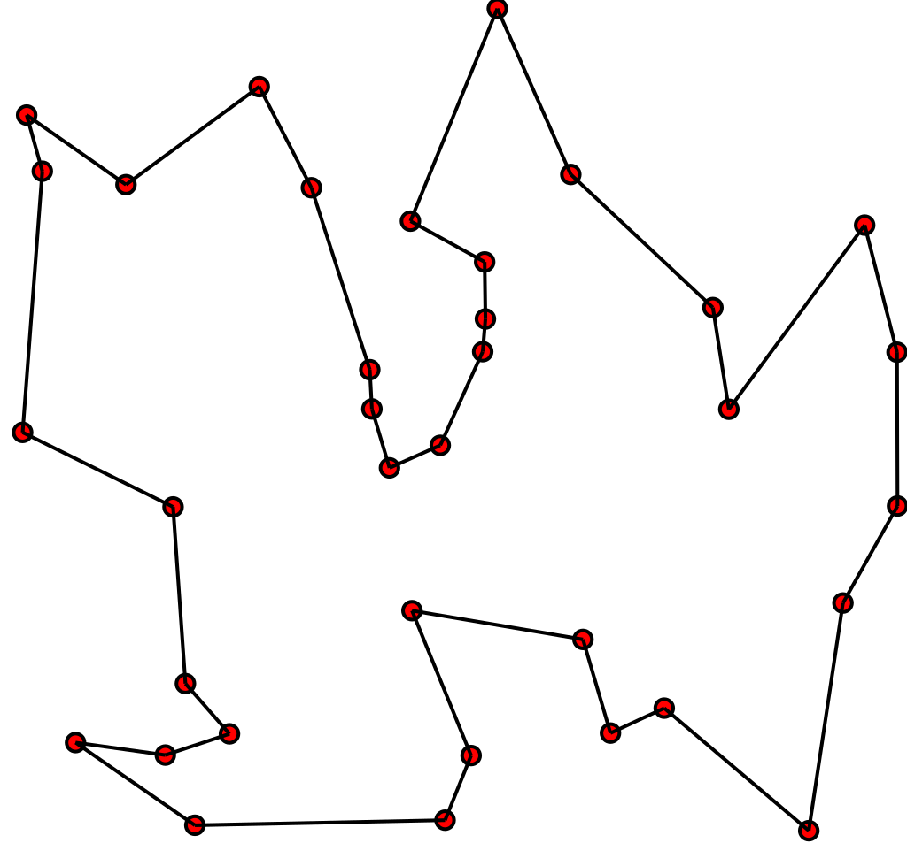

# TSP를 해결하기 위한 여러 휴리스틱 알고리즘의 성능 비교

# Traveling Salesman Problem ( 외판원 순회 문제 )

---

**Traveling Salesman Problem** 줄여서 **TSP**로 유명한 이 문제는 N개의 도시가 있으며 도시들 사이엔 길이 존재한다. 이때 어느 한 도시를 시작으로 N개의 도시를 모두 거쳐 다시 돌아오는 최단 경로를 구하는 문제이다.

TSP 문제가 유명한 이유는 해당 문제가 **NP-난해** 집합에 속하기 때문이다. **다이나믹 프로그래밍 기법**을 사용하여 해결하여도 지수 시간만큼 나오기 때문에 N이 20을 넘어가도 치명적일 수 있다. (NP 난해에 관해서는 더 공부하고 와야겠다)

고로 N이 많아질 때의 상황을 대비하기 위해 최적해를 보장할 수 없지만 빠른 **휴리스틱 알고리즘**을 사용한다.

# TSP를 해결하기 위해 사용한 알고리즘

---

## 비트 필드를 이용한 다이나믹 프로그래밍

기존 다이나믹 프로그래밍 구현 방식과 차이가 거의 없으며 **방문 검사**에서의 최적화가 이루어진다.

특정 노드의 방문을 표현하기 위해 **비트 마스킹**을 사용했으며 예를 들어 노드가 10개일 때, 5번째와 7번째 노드만 방문한 상태는 이렇게 표현할 수 있다

**0001010000 (80)**

그리고 i번째 노드가 방문했는지를 파악하기 위해선 해당 식을 사용할 수 있다

ex) state = 0001010000 (80), i = 5일 때,

> (state & (1 << i)) != 0 // Output : **true**
> 

비트 마스킹을 사용하면 **한 정수로 여러 가지의 상태를 표현**할 수 있으며 N개의 노드를 방문했는지 검사하고 싶을 때도 **O(1)**만큼 든다는 장점이 있다.

# TSP를 해결하기 위해 사용한 휴리스틱 알고리즘들

---

TSP를 해결하기 위해서 여러 가지 휴리스틱 알고리즘이 사용될 수 있지만 그중 2개인 **유전 알고리즘**과 **담금질 기법**을 이용하여 문제를 해결할 것이다.

## Genetic Algorithm ( 유전 알고리즘 )

**유전 알고리즘**은 해를 유전자로 표현할 때 최적해에 가까운 유전자들을 선택, 교배, 변이의 과정을 거쳐 세대가 높아질수록 최적해에 가까운 답을 구해내도록 설계된 알고리즘으로 **다윈의 적자생존 이론**을 기본 개념으로 한다는 특징이 있다. 유전 알고리즘이 우리에게 유명한 이유는 아마 오른쪽의 영상이 크게 이바지를 하지 않았을까 싶다.

[https://youtu.be/Yr_nRnqeDp0](https://youtu.be/Yr_nRnqeDp0)

## Simulated Annealing ( 담금질 기법 )

**담금질 기법**은 **금속공학의 담금질 기법**의 특징을 따와 만들어진 알고리즘인데 특징으로는 원소를 가열하고 조금씩 냉각해 결정을 성장시켜 그 결함을 줄이는 기법이다. 기본 로직은 당장 이득이 되는 곳으로 가지만 일정 확률로 이득이 아닌 곳으로 갈 수 있으며 이러한 일정 확률은 온도가 낮아질수록 낮아진다.

# DP vs Genetic Algorithm vs Simulated Annealing

---

### 시작하기에 앞서

Genetic Algorithm과 Simulated Annealing 둘 다 구현하기에 따라, 매개 변수에 무슨 값을 넣느냐에 따라 결괏값이 다르므로 해당 지표는 객관적이라고 할 수 없다.

해당 글에서 사용한 **Genetic Algorithm**에선 좋은 유전자를 구할 확률은 이렇게 정의하였다. //

$$
P=\left(\frac{1000}{\sum_{i=0}^{N-1}d(i,i+1)+d(N,0)}\right)^{2}
$$

이때 P는 적합도이며 d(i, j)는 노드 i와 j 사이의 거리를 의미한다.

또한 해당 글에서 사용한 Simulated Annealing에서 안 좋은 해를 선택할 확률은 이렇게 정의하였다.

$$
P=e^{\frac{E_{1}-E_{2}}{T}}
$$

이때 P는 확률을 의미하며 E1은 현재 거리, E2는 새로운 상태의 거리, T는 온도를 의미한다.

## 구현한 알고리즘의 시간복잡도

---

**Dynamic Programming** 같은 경우 노드의 개수를 N이라 할 때 시간복잡도는 다음과 같다

$$
O(N^{2} \times 2^{N})
$$

**Simulated Annealing** 같은 경우 노드의 개수를 N, 온도 감률을 T, 임계온도를 L이라 하였을 때 시간복잡도는 다음과 같다.

$$
O(N \times log_{T}L)
$$

**Genetic Algorithm** 같은 경우 노드의 개수를 N, 자식의 개수를 M, 세대의 임계점을 L이라 하였을 때 시간복잡도는 다음과 같다.

$$
O(N \times M \times L)
$$

**Simulated Annealing**의 T,L과 **Genetic Algorithm**의 M,L은 **상수**이므로 시간복잡도의 경우 다음과 같은 지표를 나타낸다.

시간복잡도 면에서는 **Dynamic Programming**보다 **Simulated Annealing**과 **Genetic Algorithm**이 강세를 보인다.

$$
SA = GA < DP
$$

## 구현한 알고리즘의 공간복잡도

---

**Dynamic Programming**의 경우 노드의 개수를 N이라 할 때 공간복잡도는 다음과 같다.

$$
O(N \times 2^{N})
$$

**Simulated Annealing**의 경우 노드의 개수를 N이라 할 때 공간복잡도는 다음과 같다

$$
O(N)
$$

**Genetic Algorithm**의 경우 노드의 개수를 N, 한 세대당 유전자의 개수를 M이라 할 때 공간복잡도는 다음과 같다.

$$
O(N \times M)
$$

빨강, 파랑, 초록 순으로 각각 DP, SA, GA 이다

비록 **GeneticAlgorithm**의 M은 상수이기 때문에 **Simulated Annealing**과 공간복잡도가 같다고 볼 수 있으나 한 세대당 유전자의 개수는 많으면 많을 수록 더 높은 정확도를 보이기 때문에  공간복잡도면에선 **Simulated Annealing**이 강세를 보인다고 할 수 있다.

$$
SA < GA < DP
$$

## 출력값의 정확도

---

우선 전제 조건은, 앞에서 계산한 시간복잡도 수식에 근거하여 Simulated Annealing과 Genetic Algorithm의 **성능이 같게 하도록 매개변수를 설정**할 것이다.

실험은 총 6개의 케이스로 진행하였으며 데이터는 알고리즘마다 100개의 데이터를 수집하였다.

| SA의 매개변수 M x L의 값 \ 노드의 갯수 | 10 | 30 |
| --- | --- | --- |
| 2302 | 2302/10 | 2302/30 |
| 2302584 | 2302584/10 | 2302584/30 |

## M * L 값이 2302이고 노드의 개수가 10개일 때

Simulated Annealing은 100개의 데이터 모두 일관된 값을 유지하는 반면에 Genetic Algorithm의 경우 상대적으로 값이 분산되어있음을 보여준다

**Simulated Annealing > Genetic Algorithm**

## M * L 값이 2302이고 노드의 개수가 30개일 때

노드의 개수가 30개로 늘어났을 때 그 차이는 확실히 더 심해진 것을 볼 수 있다.

이로써 시간복잡도가 상대적으로 낮은 경우, 같은 시간 대비 Simulated Annealing의 데이터가 더 좋은 해를 보여준다는 것을 알 수 있다.

**Simulated Annealing > Genetic Algorithm**

## M * L 값이 230258이고 노드의 개수가 10개일 때

M * L 값이 늘어난 결과 노드의 개수가 똑같은 10개이더라도 두 알고리즘 다 최적값으로 수렴한다는 것을 알 수 있었다.

**Simulated Annealing == Genetic Algorithm**

## M * L 값이 230258이고 노드의 개수가 30개일 때

노드의 개수가 30개로 늘어났을 때 M * L 값이 2,302일 때보다 확실히 결괏값이 최적해에 더 가까워 진 것을 볼 수 있다. 하지만 같은 시간복잡도로 측정하였을 때 Simulated Annealing의 **표준 편차가 더 작은 것**을 볼 수 있다.

**Simulated Annealing > Genetic Algorithm**

### 개인적인 평가 및 느낀 점

Simulated Annealing과 Genetic Algorithm 둘 다 구현해보면서 느꼈던 점은 Genetic Algorithm은 **값이 변화할 요소**(적합도 계산, 교차 방식, 변이 등)가 많다는 것이다. 이는 매개 변수를 잘 설정하면 더욱더 정교한 알고리즘을 짤 수 있다는 장점이 되지만 **값이 어떻게 변화할지 예측하기 힘들다**는 단점이 나로선 가장 크게 다가왔다.

그에 반해 Simulated Annealing의 경우 자연로그의 밑 e를 이용한 그래프를 사용함으로써, 그래프로 나타냈을 때 확률의 변화량이 **직관적**으로 나타날 수 있었으므로 나로서는 Simulated Annealing을 구현할 때 더 수월하게 구현할 수 있었다.

고로 다음에 휴리스틱 알고리즘을 사용해야 할 때 둘 다 선택할 수 있는 상황이 온다면 공간복잡도에서 상대적으로 효율이 높으며, 구현이 간단하고 직관적이고 결괏값이 최적해에 더 가까운 **Simulated Annealing**을 선택할 것 같다.

### 참고한 자료 및 완성 프로젝트 (Unity2D)

---

**완성된 프로젝트** 

https://github.com/s53809/Derivative-Free_Optimization/

[https://github.com/s53809/Derivative-Free_Optimization/](https://github.com/s53809/Derivative-Free_Optimization/)

- **참고한 자료**
    
    위키피디아 DFO 관련 : [https://en.wikipedia.org/wiki/Derivative-free_optimization](https://en.wikipedia.org/wiki/Derivative-free_optimization)
    위키피디아 담금질 기법 관련 : [https://en.wikipedia.org/wiki/Simulated_annealing#Overview](https://en.wikipedia.org/wiki/Simulated_annealing#Overview)
    담금질 기법 Koosaga 블로그 : [https://koosaga.com/3](https://koosaga.com/3)
    담금질 기법 원리 설명 블로그 : [https://sens.tistory.com/404](https://sens.tistory.com/404)
    위키피디아 외판원 문제 (한글) : [https://ko.wikipedia.org/wiki/외판원_문제](https://ko.wikipedia.org/wiki/%EC%99%B8%ED%8C%90%EC%9B%90_%EB%AC%B8%EC%A0%9C)
    꺼무위키 외판원 문제 : [https://namu.wiki/w/외판원 순회 문제](https://namu.wiki/w/%EC%99%B8%ED%8C%90%EC%9B%90%20%EC%88%9C%ED%9A%8C%20%EB%AC%B8%EC%A0%9C)
    그래프 그리기 사이트 : [https://www.desmos.com/calculator?lang=ko](https://www.desmos.com/calculator?lang=ko)
    과거에 올렸던 유전 알고리즘 블로그 : [https://notminseodevelop.tistory.com/19](https://notminseodevelop.tistory.com/19)
    유전알고리즘 참고한 사이트 : [https://untitledtblog.tistory.com/110](https://untitledtblog.tistory.com/110)
    외판원문제 : [https://www.acmicpc.net/problem/2098](https://www.acmicpc.net/problem/2098)
    계산 복잡도 블로그 : [https://velog.io/@qwe910205/계산-복잡도-클래스-P-NP-NP-완전](https://velog.io/@qwe910205/%EA%B3%84%EC%82%B0-%EB%B3%B5%EC%9E%A1%EB%8F%84-%ED%81%B4%EB%9E%98%EC%8A%A4-P-NP-NP-%EC%99%84%EC%A0%84)
    계산 복잡도 꺼무위키 : [https://namu.wiki/w/P-NP 문제](https://namu.wiki/w/P-NP%20%EB%AC%B8%EC%A0%9C)
    계산 복잡도 위키피디아 : [https://en.wikipedia.org/wiki/NP_(complexity)](https://en.wikipedia.org/wiki/NP_(complexity))